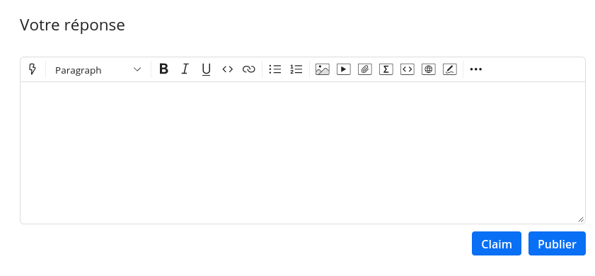
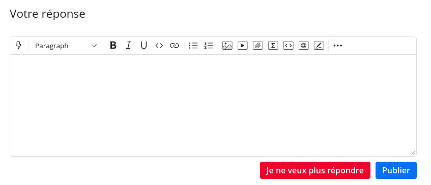
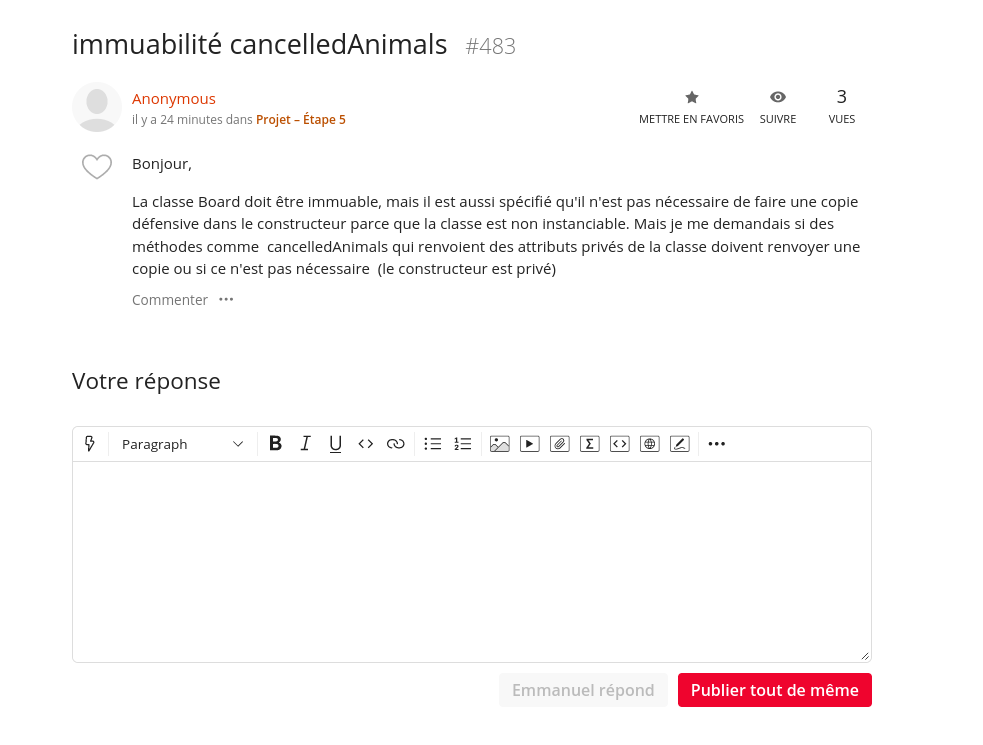

# SplitED

## Démo

Un userscript Violentmonkey pour communiquer aux autres étudiants qu'une réponse à une question est déjà en train d'être rédigée.
Cela permet d'éviter des pertes de temps et les doubles-réponses (il arrive souvent qu'un message soit rédigé pendant plusieurs mins par deux personnes différentes).

## Thread en cours de rédaction

Quelqu'un dans le groupe souhaite déjà répondre à la question et est en train de rédiger

## Installation

* vous devez disposer d'un gestionnaire de scripts, comme ViolentMonkey
* si vous souhaitez disposer des MaJ en temps réel, importez depuis l'URL, sinon importez depuis le fichier .js
* L'URL : `https://raw.githubusercontent.com/polysource-projects/edstem-splited/master/client/index.js`
